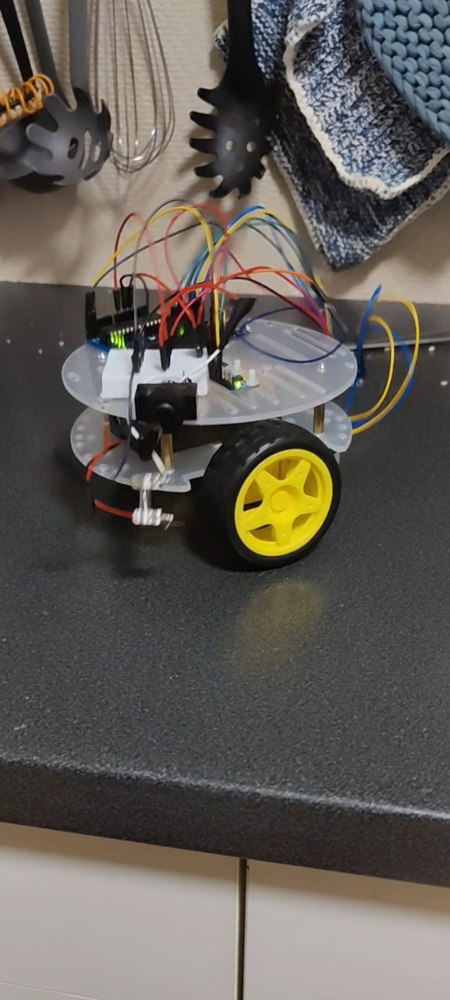

# Self-Balancing Two-Wheel Robot

A self-balancing robot built with an Arduino Uno, MPU6050 IMU, and TB6612
motor driver. Tuned to balance for 3+ minutes without encoders.

Video: https://youtube.com/shorts/MXbHpP8IKzA

## Hardware
- Arduino Uno R3
- MPU6050 (I2C)
- Adafruit TB6612 motor driver
- 2x TT gear motors (1:48), 65 mm wheels
- 2x 18650 batteries in series (7.2-8.4V), 2.5A fuse, on/off switch

## Power
Battery -> fuse -> switch -> Arduino VIN and TB6612 VM (motors).
Arduino's 5V pin feeds TB6612 VCC and the MPU6050. Common ground.
Motors run directly off the battery, so PWM is capped at 180/255 (max ~6V).

## Pins
| Function | Pin |
|---|---|
| MPU6050 SDA / SCL | A4 / A5 |
| PWMA / AIN1 / AIN2 | 5 / 9 / 8 |
| PWMB / BIN1 / BIN2 | 6 / 11 / 12 |
| STBY | 10 |

## How it works
- Tilt angle from accelerometer + gyro, combined with a complementary filter
- Fixed 200 Hz control loop
- Gyro bias calibrated at startup (robot must be still for ~3s)
- PID control, with the D-term taken directly from the gyro rate
- Deadband compensation (MIN_PWM) for the motors
- Safety cutoff when the angle is more than 30° from the balance point

## Final tuned parameters
| Parameter | Value |
|---|---|
| Kp | 30 |
| Ki | 2.0 |
| Kd | 1.6 |
| Setpoint | 2.0° |
| MIN_PWM | 40 |
| MAX_PWM | 180 |

## Tuning
Tuned one parameter at a time. Balance time increased from ~3 seconds to
over 3 minutes. The setpoint had to be a fixed value, measured by balancing
the robot on an edge, rather than measured at startup.

## Limitations
- No encoders, so the robot doesn't hold its position
- Tuned with a fully charged battery
- Backlash in the plastic gears causes a small vibration around balance

## Usage
1. Open `inverted_pendulum_robot_tuned/inverted_pendulum_robot_tuned.ino` in the Arduino IDE
2. Select Arduino Uno and the correct port, then upload
3. Place the robot on a flat surface and keep it still for 3 seconds after power-on
4. Lift it up into balance position; the controller activates within 3° of the setpoint
